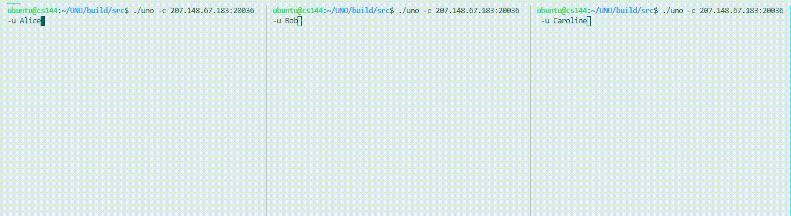
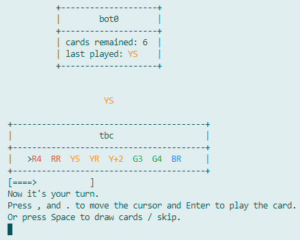

简体中文 | [English](./README.en.md)

# UNO


没错！纸牌游戏 **UNO**！

## 示例



*三人对局*

## 安装

### 下载可执行文件

前往 [Releases](https://github.com/Gusabary/UNO/releases) 页面以下载构建好的可执行文件。

### 从源码构建

当然您也可以从源码构建。

#### 准备工作

+ 确保 CMake 版本 >= 3.14
+ 确保编译器支持 C++17

  | 平台    | 构建                                                         |
  | ------- | ------------------------------------------------------------ |
  | Linux   | GCC 8.4.0   |
  | Windows | MSVC 19.28 (Visual Studio 16 2019)   |
  | MacOS   | AppleClang 10.0.1   |

#### 开始构建

克隆仓库并进行构建：

```bash
git clone git@github.com:Gusabary/UNO.git
cd UNO/script

# for linux and mac
chmod +x ./build.sh
./build.sh

# for windows
.\build.bat
```

构建完成后，`uno` 可执行文件会在 `build/src` 目录下。

（如果在构建过程中遇到有关 git 子模块的配置问题，可以参考该 [issue](https://github.com/Gusabary/UNO/issues/1)）

可选地，将 `uno` 可执行文件安装到 `PATH` 路径下：

```shell
make install
```

在构建的过程中，可以指定 CMake 的 `BUILD_TEST` 和 `ENABLE_LOG` 选项以构建测试和日志。

浏览 Wiki 以查看完整的[构建选项](https://github.com/Gusabary/UNO/wiki/%E9%85%8D%E7%BD%AE%E4%BF%A1%E6%81%AF)信息。

## 快速开始

推荐使用 VSCode 的终端，其他大部分终端都会有类似闪烁的现象，比较影响游戏体验。

### 开始第一场对局

```shell
./uno -c 8.133.165.59:20020 -u username
```

其中，`-c` 参数为游戏的服务器地址，`-u` 参数为玩家的用户名。

`8.133.165.59:20020` 为预启动的一个游戏服务，该服务配置为两人对局并有一个电脑，即人机对战。如果该服务已被占用，玩家可以尝试连接 20021 ~ 20024 中的任意端口。

浏览 Wiki 以查看更多关于[启动参数配置](https://github.com/Gusabary/UNO/wiki/%E9%85%8D%E7%BD%AE%E4%BF%A1%E6%81%AF)和[预启动游戏服务](https://github.com/Gusabary/UNO/wiki/%E9%A2%84%E5%90%AF%E5%8A%A8%E7%9A%84%E6%B8%B8%E6%88%8F%E6%9C%8D%E5%8A%A1)的信息。

进入游戏后界面如下所示：



按照提示文字所显示的，按下 `,` 或 `.` 键以移动光标，按下回车键以打出光标目前所指的手牌，按下空格键以跳过出牌（即摸牌，除非前一个玩家打出 Skip 牌则可以不摸）

浏览 Wiki 以查看完整的 [UI 及操作方式](https://github.com/Gusabary/UNO/wiki/UI-%E5%8F%8A%E6%93%8D%E4%BD%9C%E6%96%B9%E5%BC%8F)的介绍，以及可能和您玩过的 UNO 稍有不同的[游戏规则](https://github.com/Gusabary/UNO/wiki/%E6%B8%B8%E6%88%8F%E8%A7%84%E5%88%99)。

### 启动自己的游戏服务

```
./uno -l 9091
```

其中，`-l` 参数为游戏服务所在的端口。

启动以后，玩家可以通过 `./uno -c localhost:9091` 进行连接。如果游戏服务所在的机器有公网 IP（例如 `x.y.z.w`），别的玩家可以通过 `./uno -c x.y.z.w:9091` 进行连接。（如果网络连接失败，建议先检查防火墙、安全组、端口映射等网络配置，确保服务已暴露出去）

可选地，通过 `-n` 参数指定该对局的玩家人数（默认为 3 人）。

## 待实现

- [ ] 改善关于网络连接的玩家体验
- [ ] 游戏内中文支持
- [ ] 更完善的 Windows 支持
- [ ] 完善 UNO 规则细节
- [ ] 配置键盘映射方式
- [ ] 寻找合适的 Unicode 字符以表示 Reverse 和 Skip 牌
- [ ] 个性化 banner

浏览 Wiki 以查看[待实现功能的具体需求](https://github.com/Gusabary/UNO/wiki/%E5%BE%85%E5%AE%9E%E7%8E%B0%E5%8A%9F%E8%83%BD%E7%9A%84%E8%AF%A6%E7%BB%86%E9%9C%80%E6%B1%82)。

*寻求帮助！*

## 杂感

这个小玩意儿断断续续差不多写了大半个学期，本意是想以实践的方式学习 [Asio 网络库](http://think-async.com/Asio/index.html)和现代 C++ 的一些语言特性，游戏本身只是一个载体，所以不管是在对 UNO 规则的完整支持还是玩家的体验上，仍然有不少的缺憾。但是通过这小几千行代码，我的的确确精进了不少对于现代 C++ 的理解和运用，包括智能指针、右值引用、Lambda 表达式以及并发。我也在尝试使用 C++17 的一些语法特性，比如结构化绑定、编译期 if、`std::optional` 等等等等，不过也并非所有地方都使用得恰到好处，有些写法就难免有矫揉造作之嫌。

总之，第一阶段的工作已经告一段落，目前的成果离我最开始的设想与预期也没有很大的偏差。如果您有兴趣和时间，欢迎与我们一起将这个小玩意儿变得更好；如果没有也没关系，叫上朋友们一起来一局紧张刺激的线上 UNO 吧！

## 使用许可

[MIT](./LICENSE)